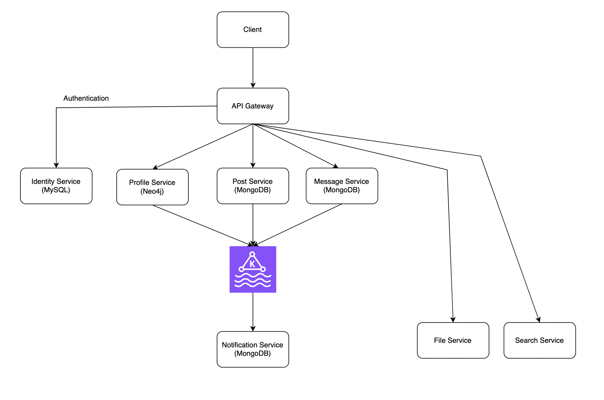

# Wibu-Forums

A community-driven platform where anime and manga enthusiasts (wibus) come together to share knowledge, discuss their favorite series, and connect with like-minded fans. Built with a microservices architecture using Spring Boot for scalability and performance.

## Table of Contents

- [Project Diagram](#i-project-diagram)
- [Tech Stack](#ii-tech-stack)
- [Features](#iii-features)
  - [Services](#a-services)
    - [API Gateway](#1-api-gateway)
    - [Identity Service](#2-identity-service)
    - [Profile Service](#3-profile-service)
    - [Post Service](#4-post-service)
    - [Notification Service](#5-notification-service)
  - [Error Codes](#b-error-codes)
  - [Clean Up](#c-clean-up)
- [Debt](#iv-debt)
- [Running the Application](#v-running-the-application)

## I. Project Diagram

## II. Tech Stack

- **Languages:** Java, TypeScript, HTML, CSS
- **Frameworks & Libraries:** Spring Boot, ReactJS, Bootstrap
- **Testing:** Postman
- **Database Management Systems:** MySQL, MongoDB, Neo4j
- **Others:** Kafka, WebSocket

## III. Features

### A. Services

#### 1. API Gateway
- **Dependencies:** Spring Cloud Gateway
- **Usage:**
  - Provides a simple and effective way to route requests to APIs.
  - Enhances the security of the project's APIs.
  - Non-Blocking I/O Operations: Utilizes reactive programming to process requests asynchronously.

#### 2. Identity Service
- **DBMS:** MySQL
  - **Why MySQL?**
    - **Structured Data:** The data in the Identity Service has a specific and fixed structure.
    - **Relational Data:** The relationships between entities must be well-defined and require relational database features.
  - **Database Diagram:**
    
- **Features:**
  - JWT-based authentication and authorization.
  - Google Authentication:
    - **How It Works:**
      - **Workflow Diagram:**
        
      - **Workflow:**
        1. The user sends a login request and is redirected to Google's login page.
        2. After logging in, the user is redirected back to the client's web page with an authorization code in the URL.
        3. The web page then calls an API on the server with the authorization code.
        4. The server exchanges the code for an access token from Google to retrieve user information.
        5. After receiving the token, the server fetches user information from Google, creates its own token for authorization, and sends an authentication response to the client.
    - **For Details:**
      - [Google Identity Protocols](https://developers.google.com/identity/protocols/oauth2)
      - [Google OAuth 2.0 Web Server Flow](https://developers.google.com/identity/protocols/oauth2/web-server)
  - **Registration:**
    - Uses Brevo to send verification emails, with Kafka sending messages to the Notification Service for email processing.

#### 3. Profile Service
- **DBMS:** Neo4j
  - **Why Neo4j?**
    - **Graph Database:** Ideal for social media applications.
    - **Performance:** Graph algorithms efficiently handle operations compared to joining tables in relational databases.
    - **Flexibility:** Easily add new attributes to nodes.
  - **Usage:**
    - Manages user profile operations (CRUD).
    - Handles user relationship operations (e.g., add friend, unfriend).
    - Uses Kafka to send friend request and response messages to the Notification Service for user notifications.
  - **Add-friend Workflow Diagram:**
  

#### 4. Post Service
- **DBMS:** MongoDB
  - **Why MongoDB?**
    - **Flexibility:** Easily add new fields to documents and save different types of posts in the same collection.
    - **JSON-like Document Storage:** Posts fit well with a JSON-like format due to varying field requirements for different post types.
    - **Horizontal Scaling:** Supports scalability.
  - **Usage:**
    - Manages post operations (CRUD).
    - Handles comment operations (CRUD).
    - Uses Kafka to send notifications for new posts and comments to the Notification Service.

#### 5. Notification Service
- **DBMS:** MongoDB
  - **Why MongoDB?**
    - **Flexibility:** Easily add new fields to documents and save different types of notifications in the same collection.
    - **JSON-like Document Storage:** Notifications are suitable for a JSON-like format due to varying field requirements for different notification types.
    - **Horizontal Scaling:** Supports scalability.
  - **Usage:**
    - Receives messages from other services to send notifications to users.
    - Provides real-time notifications to users via WebSocket.
    - Sends verification emails using Brevo.

### B. Error Codes

| HTTP Status           | Error Side (Developer, Client, Undefined) | Error Code |
|-----------------------|-------------------------------------------|------------|
| Internal Server Error | Undefined                                 | 9999       |
| Internal Server Error | Developer                                 | 1xxx       |
| Bad Request           | Client                                    | 2xxx       |
| Unauthorized          | Client                                    | 3xxx       |
| Forbidden             | Client                                    | 4xxx       |
| Not Found             | Client                                    | 5xxx       |

### C. Clean Up

- Expired tokens are automatically cleaned up after 24 hours.

## IV. Debt

- **API Gateway:** Cannot handle duplicate CORS headers when connecting via WebSocket; clients must use the port of the **Notification Service**.

## V. Running the Application

**The project is still in development period.**